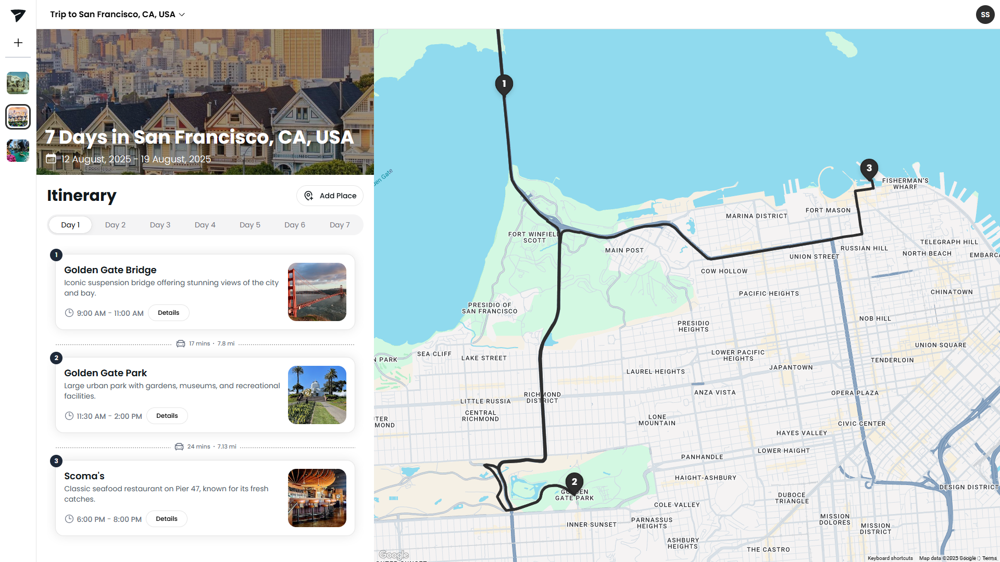

<p align="center">
  
</p>

<h1 align="center">
  Traverse - AI Itinerary Planner
  <br>
</h1>

<h4 align="center">An AI-powered platform that creates personalized travel itineraries to simplify and enhance the way users plan their trips.</h4>

<p align="center">
  <a href="https://reactjs.org/" target="_blank" rel="noopener noreferrer">
    
  </a>
  <a href="https://nodejs.org/" target="_blank" rel="noopener noreferrer">
    
  </a>
  <a href="https://expressjs.com/" target="_blank" rel="noopener noreferrer">
    
  </a>
  <a href="https://tailwindcss.com/" target="_blank" rel="noopener noreferrer">
    
  </a>
  <a href="https://supabase.com/" target="_blank" rel="noopener noreferrer">
    
  </a>
  <a href="https://docker.com/" target="_blank" rel="noopener noreferrer">
    
  </a>
  <a href="https://developers.google.com/maps" target="_blank" rel="noopener noreferrer">
    
  </a>
</p>


## What is Traverse ?

Traverse is a digital platform that enhances travel planning by creating personalized, AI-driven itineraries tailored to your interests, budget, and travel style. Seamlessly integrated with Google Maps for real-time navigation and route optimization, Traverse simplifies the planning process for trips.

By offering intelligent recommendations and easy itinerary management, it reduces the complexity of travel planning, helping users focus on enjoying their journey.

## Demo

Try it at [traverse.shreyansh-dev.app](https://traverse.shreyansh-dev.app/login)

## Features

### AI & Planning

- **AI-Powered Itinerary Generation**: Create personalized travel plans using Google's Gemini AI
- **Multi-Day Trip Planning**: Organize itineraries into days with automatic management
- **Budget Planning**: Include budget considerations in trip planning
- **Traveler Count**: Plan trips for different group sizes

### Maps & Navigation

- **Interactive Maps**: Google Maps integration with animated markers and route visualization
- **Real-time Route Planning**: Automatic route optimization and travel time calculations
- **Place Search & Auto-Complete**: Intelligent search with Google Places API
- **Multi-location Routing**: Optimized routes between multiple destinations
- **Real-time Updates**: Live synchronization between map and itinerary views

### User Experience

- **Drag & Drop Interface**: Intuitive reordering of places in your itinerary
- **Place Details & Photos**: Rich place information including images, reviews, website, contact details, and ratings from Google Places API
- **Anonymous Mode**: Try the app without creating an account
- **Responsive Design**: Modern UI optimized for all devices

### Trip Management

- **Create & Edit Trips**: Create, edit, rename, and delete trips
- **Notes & Preferences**: Add custom notes to your trips
- **User Authentication**: Secure authentication with Supabase

## Architecture

The project follows a microservices architecture with three main components:

- **Frontend**: React application with Vite build system
- **Backend**: Node.js/Express API server
- **Database**: Supabase (PostgreSQL) for data persistence

## Quick Start

### Prerequisites

- Docker and Docker Compose
- Node.js (for local development)
- Google Maps API key
- Google Gemini API key
- Supabase account and project

### Environment Setup

1. **Clone the repository**

   ```bash
   git clone <repository-url>
   cd Traverse
   ```

2. **Set up environment variables**

   Create `.env` files in both `Backend/` and `Frontend/` directories:

   **Backend/.env:**

   ```env
   SERVER_PORT=3000
   JWT_SECRET=your_jwt_secret
   GOOGLE_MAPS_API_KEY=your_google_maps_api_key
   GEMINI_API_KEY=your_gemini_api_key
   PUBLIC_SUPABASE_URL=your_supabase_url
   SUPABASE_URL=your_supabase_url
   SUPABASE_ANON_KEY=your_supabase_anon_key
   SUPABASE_SERVICE_ROLE_KEY=your_supabase_service_role_key
   ```

   **Frontend/.env:**

   ```env
   VITE_BACKEND_URL=http://localhost:3000
   VITE_SUPABASE_URL=your_supabase_url
   VITE_SUPABASE_ANON_KEY=your_supabase_anon_key
   VITE_GOOGLE_MAPS_API_KEY=your_google_maps_api_key
   ```

3. **Set up Supabase Database**

   Navigate to the Supabase directory and run the migrations:

   ```bash
   cd Supabase
   npm install
   npx supabase start
   npx supabase db reset
   ```

### Running with Docker (Recommended)

```bash
# Build and start all services
docker-compose up --build

# Access the application
# Frontend: http://localhost:5173
# Backend: http://localhost:3000
```

### Local Development

1. **Install dependencies**

   ```bash
   # Backend
   cd Backend
   npm install

   # Frontend
   cd Frontend
   npm install
   ```

2. **Start the development servers**

   ```bash
   # Backend (from Backend directory)
   npm start

   # Frontend (from Frontend directory)
   npm run dev
   ```

## Project Structure

```
Traverse/
├── Backend/                # Node.js/Express API server
│   ├── helpers/            # Utility functions
│   │   ├── gemini.js       # AI integration
│   │   ├── googleMaps.js   # Maps API integration
│   │   └── supabase.js     # Database operations
│   ├── routes/             # API endpoints
│   │   ├── trips.js        # Trip management
│   │   └── maps.js         # Maps functionality
│   └── server.js           # Main server file
├── Frontend/               # React application
│   ├── src/
│   │   ├── components/     # React components
│   │   │   ├── content/    # Content-related components
│   │   │   ├── map/        # Map-related components
│   │   │   └── ...
│   │   ├── App.jsx         # Main application component
│   │   └── main.jsx        # Application entry point
│   └── public/             # Static assets
├── Supabase/               # Database configuration
│   └── supabase/
│       └── migrations/     # Database schema
└── docker-compose.yml      # Docker configuration
```

## API Endpoints

### Trips

- `POST /api/trips/generate` - Generate AI-powered itinerary
- `GET /api/trips/` - Get all user trips
- `GET /api/trips/:id/itinerary` - Get trip itinerary
- `PUT /api/trips/:id` - Update trip details
- `DELETE /api/trips/:id` - Delete trip

### Maps

- `GET /api/maps/route` - Get route information between locations
- `GET /api/maps/places` - Search for places

## Database Schema

The application uses three main tables:

- **trips**: Stores trip metadata (title, destination, dates, budget, etc.)
- **days**: Organizes trips into daily segments
- **places**: Stores individual locations with timing and ordering information

## Technologies Used

### Frontend

- **React** - UI framework
- **Vite** - Build tool and dev server
- **Tailwind CSS** - Styling framework
- **HeroUI** - Component library
- **Framer Motion** - Animations
- **React Router** - Client-side routing
- **@vis.gl/react-google-maps** - Google Maps integration
- **@dnd-kit** - Drag and drop functionality

### Backend

- **Node.js** - Runtime environment
- **Express** - Web framework
- **Supabase** - Database and authentication
- **Google Maps API** - Location services
- **Google Gemini AI** - AI-powered itinerary generation
- **JWT** - Authentication tokens

### DevOps

- **Docker** - Containerization
- **Docker Compose** - Multi-container orchestration
