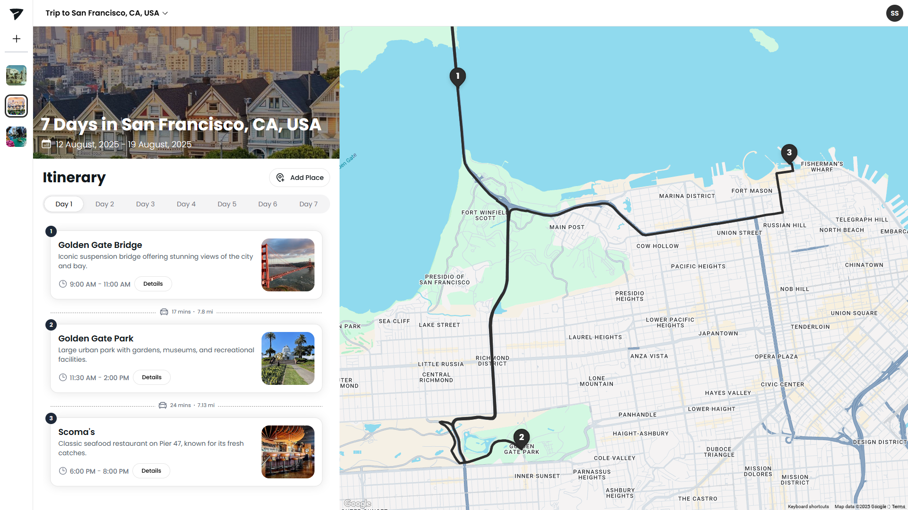

<p align="center">
  
</p>

<h1 align="center">
  Traverse - AI Itinerary Planner
  <br>
</h1>

<h4 align="center">An AI-powered platform that creates personalized travel itineraries to simplify and enhance the way users plan their trips.</h4>

<p align="center">
  <a href="https://reactjs.org/" target="_blank" rel="noopener noreferrer">
    
  </a>
  <a href="https://nodejs.org/" target="_blank" rel="noopener noreferrer">
    
  </a>
  <a href="https://expressjs.com/" target="_blank" rel="noopener noreferrer">
    
  </a>
  <a href="https://tailwindcss.com/" target="_blank" rel="noopener noreferrer">
    
  </a>
  <a href="https://supabase.com/" target="_blank" rel="noopener noreferrer">
    
  </a>
  <a href="https://docker.com/" target="_blank" rel="noopener noreferrer">
    
  </a>
  <a href="https://developers.google.com/maps" target="_blank" rel="noopener noreferrer">
    
  </a>
</p>


## What is Traverse ?

Traverse is a digital platform that enhances travel planning by creating personalized, AI-driven itineraries tailored to your interests, budget, and travel style. Seamlessly integrated with Google Maps for real-time navigation and route optimization, Traverse simplifies the planning process for trips.

By offering intelligent recommendations and easy itinerary management, it reduces the complexity of travel planning, helping users focus on enjoying their journey.

## Demo

Try it at [traverse.shreyansh-dev.app](https://traverse.shreyansh-dev.app/login)

## Features

### AI & Planning

- **AI-Powered Itinerary Generation**: Create personalized travel plans using Google's Gemini AI
- **Multi-Day Trip Planning**: Organize itineraries into days with automatic management
- **Budget Planning**: Include budget considerations in trip planning
- **Traveler Count**: Plan trips for different group sizes

### Maps & Navigation

- **Interactive Maps**: Google Maps integration with animated markers and route visualization
- **Real-time Route Planning**: Automatic route optimization and travel time calculations
- **Place Search & Auto-Complete**: Intelligent search with Google Places API
- **Multi-location Routing**: Optimized routes between multiple destinations
- **Real-time Updates**: Live synchronization between map and itinerary views

### User Experience

- **Drag & Drop Interface**: Intuitive reordering of places in your itinerary
- **Place Details & Photos**: Rich place information including images, reviews, website, contact details, and ratings from Google Places API
- **Anonymous Mode**: Try the app without creating an account
- **Responsive Design**: Modern UI optimized for all devices

### Trip Management

- **Create & Edit Trips**: Create, edit, rename, and delete trips
- **Notes & Preferences**: Add custom notes to your trips
- **User Authentication**: Secure authentication with Supabase

## Architecture

The project follows a microservices architecture with three main components:

- **Frontend**: React application with Vite build system
- **Backend**: Node.js/Express API server
- **Database**: Supabase (PostgreSQL) for data persistence

## Quick Start

### Prerequisites

- Docker and Docker Compose
- Node.js (for local development)
- Google Maps API key
- Google Gemini API key
- A Supabase backend — pick one of the two paths below

Traverse can run against **either** Supabase Cloud (a hosted project at supabase.com) **or** a self-hosted Supabase stack (`Docker/docker-compose.yml`, gated behind a Compose profile so it's entirely opt-in). Pick one before continuing.

### Environment Setup

1. **Clone the repository**

   ```bash
   git clone <repository-url>
   cd Traverse
   ```

2. **Create the shared `.env`** at the repo root (used by `Backend/`, `Frontend/`, and — if you choose that path — the self-hosted Supabase containers). The common vars, regardless of which Supabase path you pick:

   ```env
   GOOGLE_MAPS_API_KEY=your_google_maps_api_key
   GOOGLE_MAPS_MAP_ID=your_google_maps_map_id
   SERVER_PORT=3000
   GEMINI_API_KEY=your_gemini_api_key

   VITE_BACKEND_URL=http://localhost:3000
   VITE_GOOGLE_MAPS_API_KEY=your_google_maps_api_key
   VITE_GOOGLE_MAPS_MAP_ID=your_google_maps_map_id
   ```

   Then add the Supabase-specific vars from **one** of the two sections below.

---

#### Option A — Supabase Cloud

Use this if you already have (or want) a hosted project at [supabase.com](https://supabase.com) instead of running your own Postgres/Auth/REST containers.

1. Create a project in the Supabase dashboard and apply the schema in `Docker/Supabase/Initial_Schema.sql` to it (SQL Editor, or `supabase db push` against it with the CLI).
2. Grab your project's URL, anon key, and JWT secret from **Project Settings → API**, and add them to `.env`:

   ```env
   SUPABASE_URL=https://xxxxxxxx.supabase.co
   JWT_SECRET=your_projects_jwt_secret
   ANON_KEY=your_projects_anon_key

   VITE_SUPABASE_URL=https://xxxxxxxx.supabase.co
   VITE_SUPABASE_KEY=your_projects_anon_key
   ```

3. Run just the app containers — the Supabase services are skipped entirely since they're behind a Compose profile:

   ```bash
   docker compose --env-file .env -f Docker/docker-compose.yml up --build
   ```

---

#### Option B — Self-hosted Supabase (via docker-compose)

Use this if you want Postgres, Auth, REST API, and Studio running as containers alongside `backend`/`frontend`, with no external Supabase account.

1. Add the self-hosted-specific vars to `.env`:

   ```env
   SUPABASE_URL=https://your-domain/supabase    # routed to supabase-kong externally
   JWT_SECRET=a_long_random_secret               # signs/verifies every Supabase token — see step 3
   ANON_KEY=generated_from_jwt_secret             # see step 3
   SERVICE_ROLE_KEY=generated_from_jwt_secret     # see step 3
   POSTGRES_PASSWORD=a_strong_random_password
   SITE_URL=https://your-domain
   API_EXTERNAL_URL=https://your-domain/supabase

   VITE_SUPABASE_URL=https://your-domain/supabase
   VITE_SUPABASE_KEY=same_value_as_ANON_KEY
   ```

   `JWT_SECRET` must be a real random secret, **not** the Supabase demo default (`super-secret-jwt-token-with-at-least-32-characters-long`) — that value is public and would let anyone forge admin tokens against your instance.

2. Generate the Supabase API keys. `ANON_KEY`/`SERVICE_ROLE_KEY` are JWTs signed with `JWT_SECRET`, not arbitrary strings — generate them from your `JWT_SECRET` once, locally:

   ```bash
   node Docker/Supabase/generateKeys.js
   ```

   Paste the printed `ANON_KEY`/`SERVICE_ROLE_KEY` into `.env`, and set `VITE_SUPABASE_KEY` to the same `ANON_KEY` value. Re-run this any time `JWT_SECRET` changes — the two must always match.

   The database schema (`trips`, `days`, `places`, `test`, `trip-banners` storage bucket) is applied automatically the first time the `supabase-db` container boots, from `Docker/Supabase/Initial_Schema.sql`.

3. Bring the stack up with the `self-hosted` profile, which is what actually starts the Supabase containers:

   ```bash
   docker compose --env-file .env -f Docker/docker-compose.yml --profile self-hosted up --build
   ```

   This brings up `backend`, `frontend`, and `supabase-db`, `supabase-auth`, `supabase-rest`, `supabase-meta`, `supabase-kong`, `supabase-studio`.

---

### Running with Docker (Recommended)

Run from the repo root so the shared `.env` is picked up. Use the plain form for **Option A (Cloud)**:

```bash
docker compose --env-file .env -f Docker/docker-compose.yml up --build
```

or add `--profile self-hosted` for **Option B (self-hosted Supabase)**:

```bash
docker compose --env-file .env -f Docker/docker-compose.yml --profile self-hosted up --build
```

### Local Development

1. **Install dependencies**

   ```bash
   # Backend
   cd Backend
   npm install

   # Frontend
   cd Frontend
   npm install
   ```

2. **Start the development servers**

   ```bash
   # Backend (from Backend directory)
   npm start

   # Frontend (from Frontend directory)
   npm run dev
   ```

## Project Structure

```
Traverse/
├── Backend/                # Node.js/Express API server
│   ├── helpers/            # Utility functions
│   │   ├── gemini.js       # AI integration
│   │   ├── googleMaps.js   # Maps API integration
│   │   └── supabase.js     # Database operations
│   ├── routes/             # API endpoints
│   │   ├── trips.js        # Trip management
│   │   └── maps.js         # Maps functionality
│   └── server.js           # Main server file
├── Frontend/               # React application
│   ├── src/
│   │   ├── components/     # React components
│   │   │   ├── content/    # Content-related components
│   │   │   ├── map/        # Map-related components
│   │   │   └── ...
│   │   ├── App.jsx         # Main application component
│   │   └── main.jsx        # Application entry point
│   └── public/             # Static assets
├── Docker/                 # Docker configuration
│   ├── Backend/Dockerfile
│   ├── Frontend/Dockerfile
│   ├── Frontend/nginx.conf
│   ├── Supabase/
│   │   ├── Initial_Schema.sql  # applied on supabase-db's first boot
│   │   ├── kong.yml             # API gateway routes for self-hosted Supabase
│   │   └── generateKeys.js      # derives ANON_KEY/SERVICE_ROLE_KEY from JWT_SECRET
│   └── docker-compose.yml
├── .github/workflows/
│   └── deploy.yml          # Self-hosted CI/CD deploy workflow
└── .env                    # Shared env vars for Backend + Frontend
```

## API Endpoints

### Trips

- `POST /api/trips/generate` - Generate AI-powered itinerary
- `GET /api/trips/` - Get all user trips
- `GET /api/trips/:id/itinerary` - Get trip itinerary
- `PUT /api/trips/:id` - Update trip details
- `DELETE /api/trips/:id` - Delete trip

### Maps

- `GET /api/maps/route` - Get route information between locations
- `GET /api/maps/places` - Search for places

## Database Schema

The application uses three main tables:

- **trips**: Stores trip metadata (title, destination, dates, budget, etc.)
- **days**: Organizes trips into daily segments
- **places**: Stores individual locations with timing and ordering information

## Technologies Used

### Frontend

- **React** - UI framework
- **Vite** - Build tool and dev server
- **Tailwind CSS** - Styling framework
- **HeroUI** - Component library
- **Framer Motion** - Animations
- **React Router** - Client-side routing
- **@vis.gl/react-google-maps** - Google Maps integration
- **@dnd-kit** - Drag and drop functionality

### Backend

- **Node.js** - Runtime environment
- **Express** - Web framework
- **Supabase** - Database and authentication
- **Google Maps API** - Location services
- **Google Gemini AI** - AI-powered itinerary generation
- **JWT** - Authentication tokens

### DevOps

- **Docker** - Containerization
- **Docker Compose** - Multi-container orchestration
